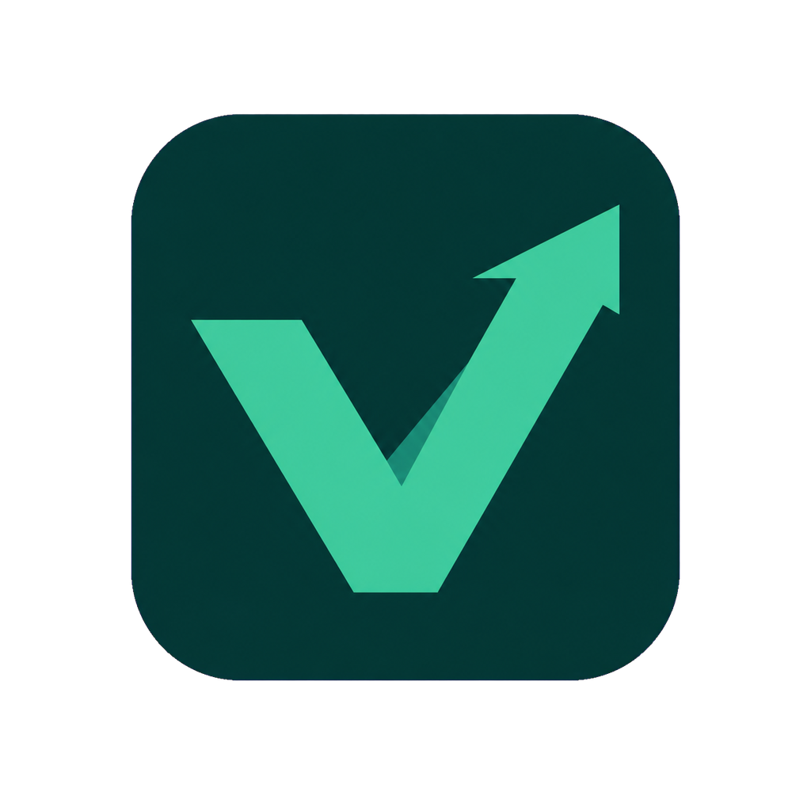

<div align="center">



# Vendix

**El sistema de ventas que no te obliga a buscar un tutorial.**

POS, inventario, caja, facturación NCF, nómina y CRM — en una sola app, pensada para negocios dominicanos que necesitan vender rápido y confiar en sus números.

[**Descargar para Windows**](https://github.com/XsharklinX/Vendix/releases/latest) · [Sitio web](https://xsharklinx.github.io/Vendix/) · [Documentación](docs/README.md) · [Reportar un problema](https://github.com/XsharklinX/Vendix/issues)

<br>


</div>

---

## Por qué existe Vendix

La mayoría de los sistemas de venta para negocios pequeños en Latinoamérica te obligan a elegir: o son tan simples que se te quedan cortos apenas creces (necesitas facturar con NCF, llevar inventario real, pagar empleados), o son tan complejos que necesitas un curso para usarlos.

Vendix apuesta a que no hace falta elegir. La primera venta se siente tan simple como anotar en una libreta — y cuando el negocio crece, ahí está el kardex, la nómina, las órdenes de compra y la facturación fiscal, sin que tengas que migrar a otro sistema ni aprender algo nuevo desde cero.

Y funciona **aunque se vaya la luz o el internet**. Las ventas se guardan localmente y se sincronizan solas cuando vuelve la conexión — porque un negocio real no se puede dar el lujo de parar de vender por eso.

---

## Contenido

- [Qué incluye](#qué-incluye)
- [Cómo se ve](#cómo-se-ve)
- [Empezar en 5 minutos](#empezar-en-5-minutos)
- [Formas de usarlo](#formas-de-usarlo)
- [Arquitectura](#arquitectura)
- [Stack técnico](#stack-técnico)
- [Nube y sincronización](#nube-y-sincronización-en-desarrollo)
- [Hoja de ruta](#hoja-de-ruta)
- [Solución de problemas](#solución-de-problemas)
- [Contribuir](#contribuir)
- [Licencia](#licencia)

---

## Qué incluye

<table>
<tr>
<td width="50%" valign="top">

**Punto de venta**
Carrito rápido, código de barras, descuentos por producto o negocio, precios por volumen y por cliente VIP, cobro en efectivo/tarjeta/transferencia/crédito, cambio calculado en denominaciones reales, atajos de teclado, sonidos de confirmación, y cola de ventas offline.

**Inventario**
Productos, categorías, costos y márgenes, kardex completo de movimientos, alertas de stock bajo por producto o globales, ajustes manuales con motivo, historial de precios, importación por CSV.

**Caja y finanzas**
Apertura y cierre de turno con usuario responsable, movimientos de ingresos y gastos, devoluciones, reportes de cierre diario (Z), reportes fiscales 606/607.

</td>
<td width="50%" valign="top">

**Clientes y fidelización**
Cuentas por cobrar con antigüedad de deuda, recordatorios directos por WhatsApp, timeline por cliente, notas y recordatorios, puntos de fidelidad, segmentos automáticos (VIP, frecuente, en riesgo).

**Compras y proveedores**
Órdenes de compra con recepción parcial, alertas de reorden, historial de proveedores y deuda pendiente.

**Equipo**
Empleados con roles (dueño / cajero), nómina, comisiones por venta, control de asistencia.

**Facturación**
NCF para República Dominicana, numeración propia, tres plantillas de recibo, envío de documentos por correo, logo y datos fiscales del negocio.

</td>
</tr>
</table>

Todo conectado: una venta descuenta inventario, alimenta la caja, suma puntos al cliente y aparece en los reportes — sin doble captura de datos.

---

## Cómo se ve

<div align="center">

*Vista previa completa disponible en el [sitio web](https://xsharklinx.github.io/Vendix/)*

</div>

---

## Empezar en 5 minutos

### Requisitos

- Node.js 18 o superior
- npm 9 o superior

<details>
<summary><strong>Instalación para desarrollo</strong></summary>

<br>

```bash
git clone https://github.com/XsharklinX/Vendix.git
cd Vendix
npm run setup
npm run dev
```

Esto levanta backend y frontend en paralelo:

| Servicio | URL |
|---|---|
| Aplicación web | `http://localhost:5173` |
| API | `http://localhost:3100` |
| Documentación interactiva de la API (Swagger) | `http://localhost:3100/api/docs` |

Antes de manejar datos reales, genera un `JWT_SECRET` propio en `backend/.env`:

```bash
node -e "console.log(require('crypto').randomBytes(64).toString('hex'))"
```

</details>

<details>
<summary><strong>Modo escritorio (Electron)</strong></summary>

<br>

```bash
npm run dev:electron
```

Abre la app como ventana nativa, con el backend embebido — así se distribuye la versión de producción.

</details>

<details>
<summary><strong>Generar el instalador de Windows</strong></summary>

<br>

```bash
npm run build       # compila backend + frontend + electron
npm run dist        # genera el instalador .exe
npm run dist:portable   # genera versión portable, sin instalación
```

Los pushes a `main` publican automáticamente una nueva release si el build completo pasa. Ver [releases y auto-actualización](docs/releases-and-auto-update.md).

</details>

### Comandos frecuentes

```bash
npm run dev              # Desarrollo: frontend + backend
npm run build            # Build completo de producción
npm run dist              # Instalador de Windows
```

Para sincronizar el esquema de base de datos tras un cambio:

```bash
cd backend
npx prisma generate
npx prisma db push
```

---

## Formas de usarlo

| Escenario | Cómo funciona |
|---|---|
| **Un solo negocio, una computadora** | Instalador de escritorio para Windows. Todo local, cero configuración de red. |
| **Varios puntos de venta en el mismo local** | Backend accesible por la red Wi-Fi del negocio; cada caja se conecta como cliente. |
| **Acceso remoto o multi-sucursal** | Backend desplegado en la nube (ver sección siguiente). |

---

## Arquitectura

```text
Vendix/
├── backend/          API en Express + Prisma, 16 módulos de rutas, SQLite local
├── frontend/          React 18 + Vite + Tailwind, 18 pantallas
├── electron/          Shell de escritorio para Windows con auto-actualización
├── scripts/           Utilidades de build y generación de base semilla
├── docs/               Sitio público (GitHub Pages) y documentación técnica
└── DEPLOY.md           Guía de despliegue
```

| Capa | Tecnología |
|---|---|
| Frontend | React 18, TypeScript, Vite, Tailwind CSS, Zustand, TanStack Query |
| Backend | Node.js, Express, TypeScript, Zod |
| Base de datos | Prisma ORM sobre SQLite (local) o PostgreSQL (nube) |
| Escritorio | Electron con actualizaciones automáticas |
| Seguridad | JWT, bcrypt, rate limiting, CSP, auditoría de acciones |

La documentación técnica completa está en [`docs/`](docs/README.md): arquitectura, esquema de base de datos, referencia de la API, autenticación y variables de entorno.

---

## Nube y sincronización (en desarrollo)

Vendix nació **local-first** — la app funciona completa sin depender de internet. Sobre esa base, se está construyendo una capa opcional de nube para quienes quieran respaldo automático y acceso desde varios dispositivos, sin tocar la experiencia local de nadie que no la necesite.

- Backend cloud ya desplegado y en funcionamiento (Railway + PostgreSQL/Neon)
- Sistema de licencias con plan gratuito completo y plan Pro opcional
- Sincronización incremental entre dispositivos — en construcción

El plan detallado está en [`docs/roadmap-saas.md`](docs/roadmap-saas.md).

---

## Hoja de ruta

El desarrollo de Vendix se organiza en tres frentes, documentados a fondo:

| Documento | Enfoque |
|---|---|
| [`docs/roadmap-v3.md`](docs/roadmap-v3.md) | Calidad técnica: accesibilidad, rendimiento, pruebas automatizadas |
| [`docs/roadmap-saas.md`](docs/roadmap-saas.md) | Infraestructura en la nube, sincronización y suscripciones |
| [`docs/roadmap-diferenciacion.md`](docs/roadmap-diferenciacion.md) | Producto y experiencia: por qué Vendix debería ser la mejor opción para un negocio dominicano |

---

## Solución de problemas

<details>
<summary><strong>El instalador de Windows no abre o falla con error 0xc0000005</strong></summary>

<br>

El instalador y el ejecutable portable aún no están firmados digitalmente. Windows Defender puede poner el archivo en cuarentena o modificarlo, corrompiendo el binario.

1. Revisa `Seguridad de Windows → Protección antivirus y contra amenazas → Historial de protección` y restaura el archivo si fue puesto en cuarentena.
2. Excluye la carpeta de salida antes de generar el build:
   ```powershell
   Add-MpPreference -ExclusionPath "E:\Programacion\Vendix\release"
   ```
3. Vuelve a ejecutar `npm run dist`.
4. Verifica que el hash del instalador coincida con el de `release/latest.yml` antes de distribuirlo.

</details>

---

## Contribuir

Antes de proponer un cambio:

1. Corre `npm run build:backend` y `npm run build:frontend` — deben pasar sin errores.
2. No rompas los flujos existentes de venta, caja, inventario o cuentas por cobrar.
3. Si tocas el esquema de base de datos o una variable de entorno, documéntalo.
4. Describe el *por qué* del cambio, no solo el *qué* — ayuda a mantener el criterio del proyecto con el tiempo.

## Licencia

MIT © 2026 [XsharklinX](https://github.com/XsharklinX) — ver [`LICENSE`](LICENSE).

<div align="center">
<sub>Hecho para negocios que no tienen tiempo que perder.</sub>
</div>
